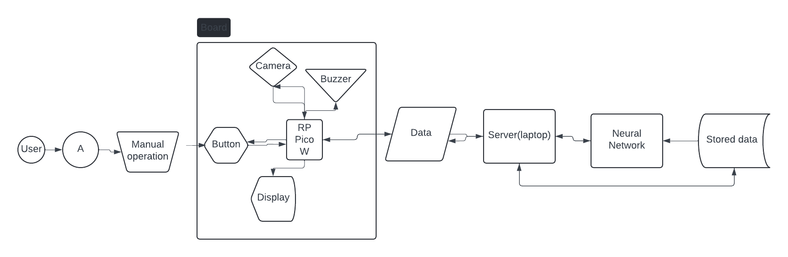
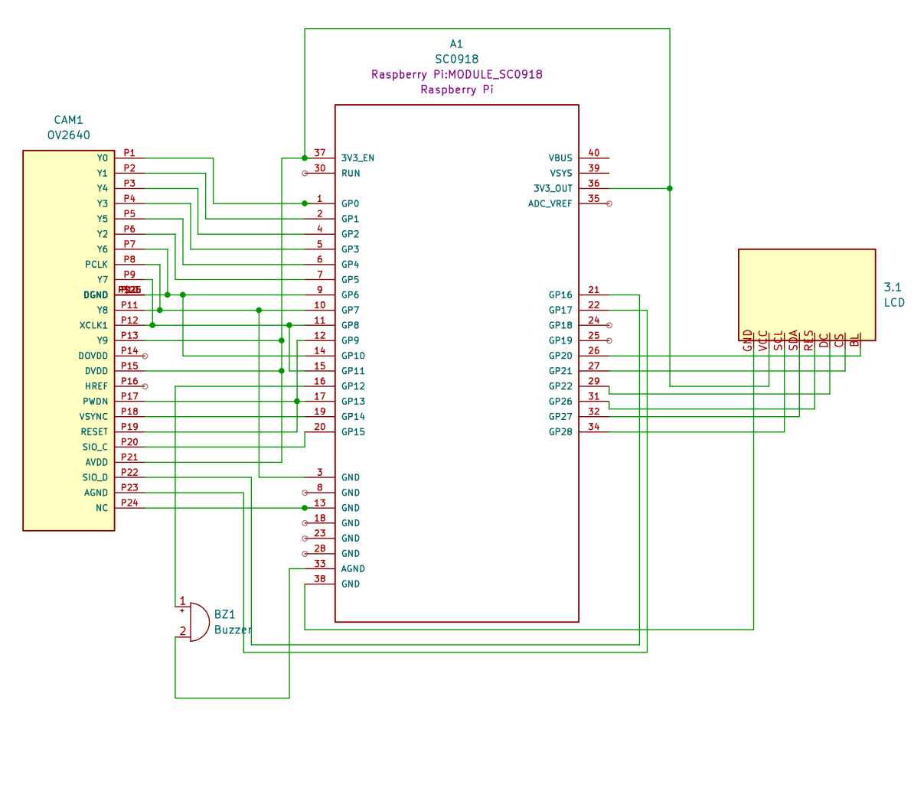

# Face Authentification

| | |
|-|-|
|`Author` | Lisman Victor-Alexandru

## Description
Ce projet vise à créer un authentificateur de visage à l'aide d'un réseau neuronal afin d'authentifier les utilisateurs enregistrés. Le visage sera scanné à l'aide d'un module caméra, puis il sera sérialisé et envoyé au modèle qui renverra la réponse. La réponse sera diffusée par le module de haut-parleur.

## Motivation
La motivation première de ce projet est ma passion pour le ML. Ce projet me permet de travailler avec du ML embarqué et me permet de devenir un meilleur ingénieur. 

## Architecture
### Déroulement du fonctionnement du système

Initialisation : Le système initialise la caméra, l'écran LCD et les autres périphériques au démarrage.
Interaction de l'utilisateur : L'utilisateur appuie sur le bouton pour lancer le processus d'authentification.
Capture d'image : L'appareil photo prend une photo du visage de l'utilisateur immédiatement après avoir appuyé sur le bouton.
Traitement de l'image : L'image est prétraitée (par exemple, redimensionnement, normalisation) pour répondre aux exigences d'entrée du réseau neuronal.
Reconnaissance faciale : L'image traitée est introduite dans le réseau neuronal, qui détermine si le visage correspond à une identité connue.
Réponse de sortie : Basée sur la sortie du réseau neuronal :
    En cas de reconnaissance (correspondance positive), l'écran LCD affiche un message de réussite et le buzzer émet un son positif.
    S'il n'est pas reconnu (correspondance négative), l'écran LCD affiche un message d'échec et le buzzer émet un son négatif.

### Connectivité
Wi-Fi : utilise le Wi-Fi intégré du Raspberry Pi Pico W pour toutes les communications réseau nécessaires, telles que l'envoi de données à un serveur pour traitement ou la réception de mises à jour du modèle de réseau neuronal.

### Block diagram

### Schematic

### Components
| Device | Usage | Price |
|--------|--------|-------|
| Microcontroller | Microcontroller | [34.5 RON](https://www.optimusdigital.ro/ro/placi-raspberry-pi/12394-raspberry-pi-pico-w.html)
| Display | Shows response from the model | [29.99](https://www.optimusdigital.ro/ro/optoelectronice-lcd-uri/1312-modul-lcd-spi-de-144-128x128-ili9163-negru.html)
| Activ Buzzer | Buzzer | [1.5 RON](https://www.optimusdigital.ro/ro/audio-buzzere/635-buzzer-activ-de-3-v.html?search_query=buzzer&results=61) |
| Push Button | Button | [1 RON](https://www.optimusdigital.ro/ro/butoane-i-comutatoare/1119-buton-6x6x6.html?search_query=buton&results=222) |
| Jumper Wires | Connecting components | [7 RON](https://www.optimusdigital.ro/ro/fire-fire-mufate/884-set-fire-tata-tata-40p-10-cm.html?search_query=set+fire&results=110) |
| Breadboard | Project board | [10 RON](https://www.optimusdigital.ro/ro/prototipare-breadboard-uri/8-breadboard-830-points.html?search_query=breadboard&results=145) |
| Camera | Used to take images | [19.99 RON](https://www.optimusdigital.ro/en/cameras/11097-ov2640-camera.html)

### Libraries
<!-- This is just an example, fill in the table with your actual components -->

| Library | Description | Usage |
|---------|-------------|-------|
| [PyTorch](https://pytorch.org/) |  Used for the model
| [OV7670](https://github.com/adafruit/Adafruit_OV7670) | Libary for using the camera
| [ST7735](https://github.com/adafruit/Adafruit-ST7735-Library) | Used for accesing the LCD
| [LittleFS]() | Used to flash the image to the storage of the pico, in case the camera does not work, if it does to save the image captured
| [Adafruit_GFX]() Used for graphics for the LCD
| [Wifi]()
| [WifiClient]()
| [HTTPClient]()
| [SPI]()

## Log

<!-- write every week your progress here -->
Wrote first iteration of the documentation.
### Week 6 - 12 May
Completed schematic, added components. Updated face recognition model.
### Week 7 - 19 May

### Week 20 - 26 May

## Reference links

<!-- Fill in with appropriate links and link titles -->

[Tutorial 1](https://www.youtube.com/watch?v=wdgULBpRoXk&t=1s&ab_channel=BenEater)

[Article 1](https://www.explainthatstuff.com/induction-motors.html)

[Link title](https://projecthub.arduino.cc/)

https://docs.arducam.com/#6-person-detection
